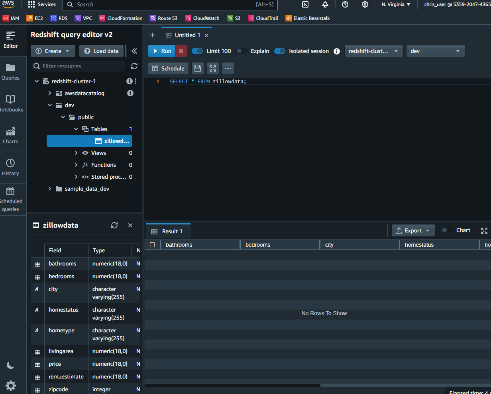

# Zillow Data Engineering Pipeline



## Overview

This project demonstrates a comprehensive data engineering solution that starts with fetching real estate listings from Zillow using its API, and then efficiently processes and manages this data through a structured pipeline involving a data lake, data warehouse, and a final ETL (Extract, Transform, Load) operation. The end product is a clean, processed CSV data which gets loaded into an Amazon Redshift database.

## Table of Contents

- [Project Highlights](#project-highlights)
- [Architecture](#architecture)
- [Prerequisites](#prerequisites)
- [Setup and Installation](#setup-and-installation)
- [Usage](#usage)
- [Contributing](#contributing)
- [License](#license)
- [Contact](#contact)

## Project Highlights

1. **Zillow API Integration**: Seamless integration with Zillow's API to fetch fresh real estate listings.
2. **Data Lake Formation**: Temporary storage allowing for data exploration, analytics, and further processing.
3. **Data Warehousing**: Structured data management ensuring scalability and reliability.
4. **ETL Processing**: Converting complex JSON data into user-friendly CSV format.
5. **Amazon Redshift Integration**: Data storage solution making querying efficient and easy.

## Architecture

The pipeline follows a structured flow:

1. **Data Collection**: Airflow runninging on an EC2 instance with a DAG that manages the retrieval of listings in JSON with [Zillow API](https://rapidapi.com/s.mahmoud97/api/zillow56)

2. **Data Lake**: Using AWS Lambda function to store the raw JSON in an S3 bucket allowing for flexibility and scalability.

3. **Data Warehouse**: Using another AWS Lambda function to process the JSON into CSV with select columns and then loading into another S3 bucket.

4. **ETL Process**: The data is then parsed and loaded into AWS Redshift database for querying and processing.

## Prerequisites

- An AWS Account
- Configured AWS CLI
- Zillow API Key
    - [Checkout API Hub](https://rapidapi.com/s.mahmoud97/api/zillow56)

## Setup and Installation

1. **Clone the repository**:
    ```bash
    git clone https://github.com/rambles-tech/zillow_analytics_pipeline
    ```

2. **Navigate to the project directory**:
    ```bash
    cd zillow_analytics_pipeline
    ```

3. **Set up the required environment variables**:
    - AWS_ACCESS_KEY_ID
    - AWS_SECRET_ACCESS_KEY
    - ZILLOW_API_KEY

4. **Execute the setup script** (this will set up necessary resources on AWS and configure other required settings):
    ```bash
    ./setup.sh
    ```

## Usage

To start the data engineering pipeline:

```bash
python run_pipeline.py
```

## Contributing
Many thanks to [@tuplespectra](https://www.youtube.com/@tuplespectra) for providing an in-depth example that established the base pipeline for this project.

